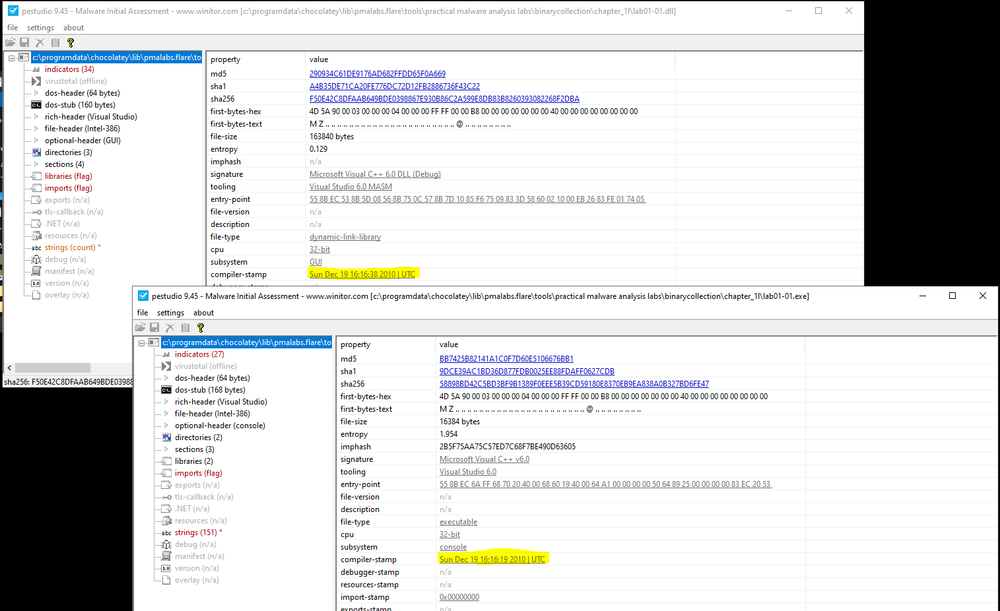
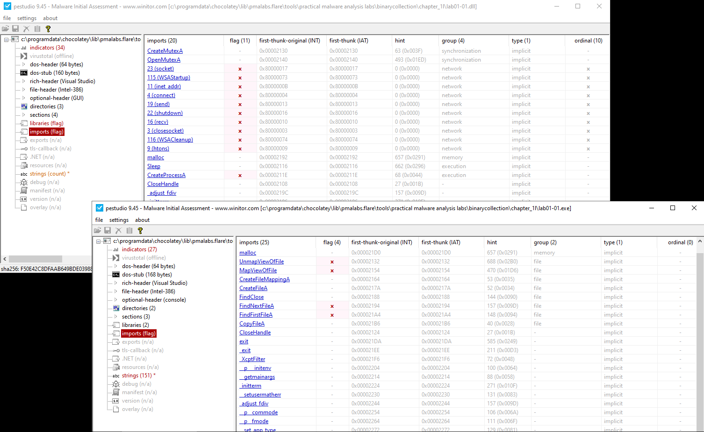
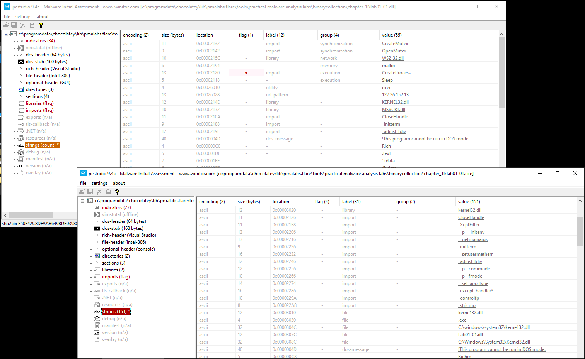
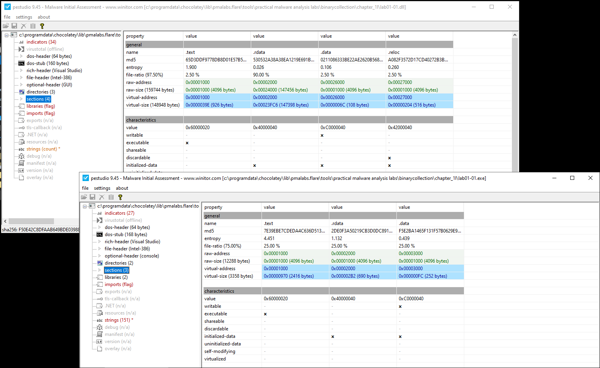

# Chapter 1: Basic Static Techniques
## Lab 1.1
This uses files *Lab01-01.dll* and *Lab01-01.exe*. 

**Upload the files to VirusTotal and view reports. Does either file match any existing antivirus signatures?**

| Filename | SHA256 Hash | VT Detection Rate |
| -------- | ----------- | ----------------- | 
| Lab01-01.dll | f50e42c8dfaab649bde0398867e930b86c2a599e8db83b8260393082268f2dba | 38/66 |
| Lab01-01.exe | 58898bd42c5bd3bf9b1389f0eee5b39cd59180e8370eb9ea838a0b327bd6fe47 | 51/72 | 

These samples were searched on December 30 2022 20:28 UTC.

**When were these files compiled?**

| Filename | Compile Time |
| -------- | ------------ | 
| Lab01-01.dll | Sun Dec 19 2010 16:16 UTC | 
| Lab01-01.exe | SUn Dec 19 2010 16:16 UTC | 

**Are there any indications that either of these files are packed or obfuscasted?**
Looking at the imports for both files, we are able to see a list of Windows APIs. 

Strings for both applications are in plaintext. 

Sections for both files do not provide evidence of packing.

DiE does not identify either sample as packed.

**Do any imports hint at what this malware does? If so, which imports are they?**
*Lab01-01.dll*
This file contains imports related to network activity include creating a socket, connecting and sending information. This also includes the function CreateProcessA is used to create a process.

Mutexes are used to ensure that there is only one instance of the file running.

*Lab01-01.exe*
CreateFile and CopyFile may be used to drop additional files to disk. UnmapViewOfFile may be used to overwrite file memory.

FindNextFile is used to iterate through files.

**Are there any other files or host-based indicators that you could look for on infected systems?**
Lab01-01.exe contains the string `C:\\windows\system32\kernel132.dll` which is made to look like kernel32.dll. This can be used as a host based indicator for signs on infection. 

**What network-based indicators could be used to find this malware on infected machines?**
Lab01-01.dll contains the string 127.26.152.13. This IP addresses can be used to find infected machines as they will have connections to it.

**What would you guess is the purpose of these files?**
Lab01-01.exe is probably used to drop lab01-01.dll or load it into another file. Lab01-01.dll is used to establish a connection to an IP.

## Lab 1.2
This uses file *Lab01-02.exe*. 
**Upload the file to VirusTotal and view reports. Does either file match any existing antivirus signatures?**
| Filename | SHA256 Hash | VT Detection Rate |
| -------- | ----------- | ----------------- | 
| Lab01-02.exe | c876a332d7dd8da331cb8eee7ab7bf32752834d4b2b54eaa362674a2a48f64a6 | 55/72 |

**Are there any indications that either of these files are packed or obfuscasted?**
DiE identifies the packer as UPX.

